# Processamento-ETL

## **Objetivo** 

O objetivo é integrar dados da camada Raw para a camada Trusted de um data lake, utilizando Apache Spark no AWS Glue. Os dados devem ser processados a partir de arquivos CSV e da API TMDB, sendo armazenados no formato PARQUET, particionados por data de criação no Amazon S3. A visão padronizada dos dados deve ser registrada no Glue Data Catalog e acessível via AWS Athena, permitindo análise com comandos SQL.

## 1. Etapa

### 1.1 Criando e Configurando o JOB

Nesta etapa, acessamos o **AWS Glue Console**, selecionamos a opção **ELT JOBS** e escolhemos **Spark Script Editor**. Como pode ser observado na imagem abaixo, esse é o primeiro passo para configurar o job que será utilizado para o processamento dos dados:


A partir dessa opção, você poderá escrever e configurar o script para processar os dados da camada Raw para a camada Trusted, utilizando o Apache Spark no AWS Glue.

Após isso, selecionamos a opção **Spark** para indicar o tipo de processamento que será utilizado no job. Veja a imagem abaixo:


 - #### Configurando o JOB

Por fim, configuramos os jobs para **Series**, **Movies** e **Json** da seguinte forma:

- **Worker type**:  
  **G.1x** (Opção de menor configuração, recomendada para este desafio).

- **Requested number of workers**:  
  **2** (Esta é a quantidade mínima de workers para o job, conforme especificado).

- **Job timeout (minutes)**:  
  Defina o tempo limite do job para **60 minutos ou menos**, se possível.

Como podemos ver nas imagens a seguir:

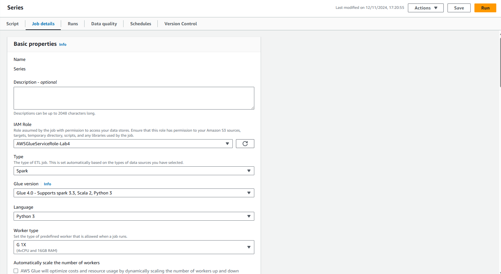  
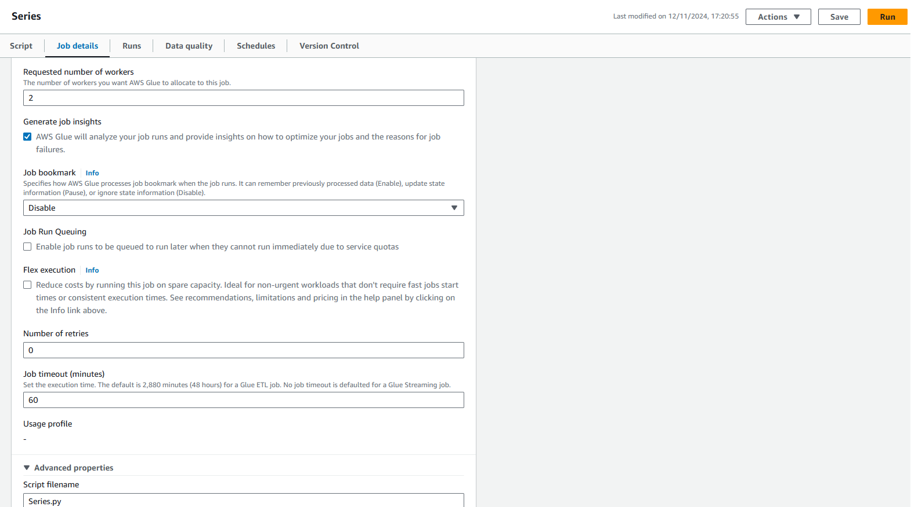  
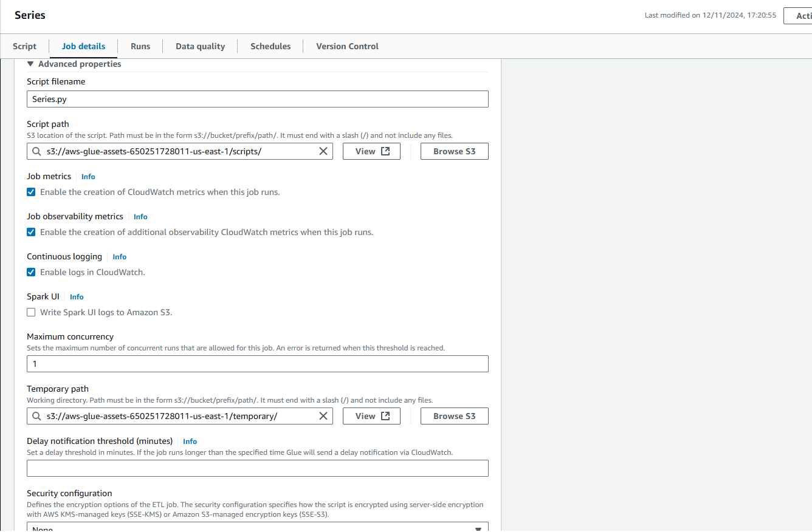

## 2. Etapa

### 2.1 Executando os JOBS

Abaixo estão os códigos dos jobs e as imagens das execuções:

 - #### CSV de Series: 

### Passo 1: Importando as bibliotecas necessárias

O primeiro bloco do código importa as bibliotecas necessárias para o processamento dos dados. A biblioteca `sys` é importada para acessar funcionalidades do sistema, enquanto `SparkContext` e `SparkSession` são utilizadas para iniciar uma sessão do Apache Spark. A função `col` é importada para manipular as colunas do DataFrame no PySpark.

```python
import sys
from pyspark.context import SparkContext
from pyspark.sql import SparkSession
from pyspark.sql.functions import col
```

### Passo 2: Inicializando a sessão do Spark

Aqui, uma sessão do Spark é inicializada com o nome "CSV_to_Parquet_Cleaned". A função `SparkSession.builder.appName()` define o nome da aplicação, e o método `getOrCreate()` garante que, se uma sessão já existir, ela será reutilizada, caso contrário, uma nova será criada.

```python
spark = SparkSession.builder.appName("CSV_to_Parquet_Cleaned").getOrCreate()
```
### Passo 3: Definindo os caminhos de entrada e saída

Aqui, são definidos os caminhos de entrada e saída dos dados. O caminho do arquivo CSV está na **Raw Zone** do Data Lake, enquanto o caminho de destino está na **Trusted Zone**, onde os dados processados serão armazenados após a limpeza.

```python
caminho_csv = "s3://data-lake-do-lucas/Raw/Local/CSV/Series/2024/10/23/series.csv"
cmBuckte = "s3://data-lake-do-lucas/TRUSTED/"
```

### Passo 4: Carregando e lendo o arquivo CSV

Neste passo, o arquivo CSV é lido utilizando o método `spark.read`. As opções configuradas, como `header="true"`, indicam que a primeira linha do arquivo contém os nomes das colunas, e `delimiter="|"` define que o delimitador entre os campos no CSV é o caractere pipe (`|`). O arquivo é carregado em um DataFrame.

```python
df = spark.read.option("header", "true").option("delimiter", "|").csv(caminho_csv)
```

### Passo 5: Limpando os dados

Após o carregamento, a limpeza dos dados é realizada. O método `dropna()` remove as linhas que contêm valores nulos, enquanto o `dropDuplicates()` remove duplicatas com dados que são identicos.

```python
df_limpo = df.dropna()
df_limpo = df_limpo.dropDuplicates()
```

### Passo 6: Convertendo Tipos de Dados

Após a limpeza inicial, é necessário garantir que cada coluna do conjunto de dados tenha o tipo correto para facilitar análises e operações futuras. Neste passo, utilizamos o método `.cast()` para ajustar os tipos de dados de várias colunas:

```python
df_limpo = df_limpo \
    .withColumn("anoLancamento", col("anoLancamento").cast("int")) \
    .withColumn("tempoMinutos", col("tempoMinutos").cast("int")) \
    .withColumn("notaMedia", col("notaMedia").cast("double")) \
    .withColumn("numeroVotos", col("numeroVotos").cast("int")) \
    .withColumn("anoNascimento", col("anoNascimento").cast("int")) \
    .withColumn("anoFalecimento", col("anoFalecimento").cast("int"))
```

- **`anoLancamento` e `anoNascimento`**: Convertidos para `int`, pois representam anos e devem ser tratados como números inteiros.
- **`tempoMinutos`**: Convertido para `int`, pois indica a duração em minutos.
- **`notaMedia`**: Convertida para `double`, já que é uma nota que pode conter casas decimais.
- **`numeroVotos`**: Convertido para `int`, representando contagens inteiras.
- **`anoFalecimento`**: Também convertido para `int`, por ser um dado de ano.

### Passo 7: Salvando os dados na Trusted Zone

Depois que os dados foram limpos, eles são salvos na **Trusted Zone** do Data Lake. O método `write.parquet()` é utilizado para salvar os dados no formato **Parquet**. O parâmetro `mode="overwrite"` garante que, se já existir um dado no local, ele será sobrescrito.

```python
df_limpo = df_limpo \
    .withColumn("ano", year(current_date())) \
    .withColumn("mes", month(current_date())) \
    .withColumn("dia", dayofmonth(current_date()))
    
sdBuckte = f"{cmBuckte}Series/{df_limpo.select('ano').first()['ano']}/{df_limpo.select('mes').first()['mes']}/{df_limpo.select('dia').first()['dia']}/"

df_limpo.write.parquet(sdBuckte, mode="overwrite")
```

### Passo 8: Finalizando a sessão do Spark

A sessão do Spark é encerrada com o método `spark.stop()`. Isso libera os recursos utilizados pelo Spark durante a execução do job.

```python
spark.stop()
```

- ## Codigo completo:  
```python
from pyspark.context import SparkContext
from pyspark.sql import SparkSession
from pyspark.sql.functions import col, current_date, dayofmonth, month, year

spark = SparkSession.builder.appName("CSV_to_Parquet_Cleaned").getOrCreate()

caminho_csv = "s3://data-lake-do-lucas/Raw/Local/CSV/Series/2024/10/23/series.csv" 
cmBuckte = "s3://data-lake-do-lucas/TRUSTED/"

df = spark.read.option("header", "true") \
    .option("delimiter", "|") \
    .option("inferSchema", "true") \
    .csv(caminho_csv)

df_limpo = df.dropna().dropDuplicates()

df_limpo = df_limpo \
    .withColumn("anoLancamento", col("anoLancamento").cast("int")) \
    .withColumn("tempoMinutos", col("tempoMinutos").cast("int")) \
    .withColumn("notaMedia", col("notaMedia").cast("double")) \
    .withColumn("numeroVotos", col("numeroVotos").cast("int")) \
    .withColumn("anoNascimento", col("anoNascimento").cast("int")) \
    .withColumn("anoFalecimento", col("anoFalecimento").cast("int"))
    
df_limpo = df_limpo \
    .withColumn("ano", year(current_date())) \
    .withColumn("mes", month(current_date())) \
    .withColumn("dia", dayofmonth(current_date()))
    
sdBuckte = f"{cmBuckte}Series/{df_limpo.select('ano').first()['ano']}/{df_limpo.select('mes').first()['mes']}/{df_limpo.select('dia').first()['dia']}/"

df_limpo.write.parquet(sdBuckte, mode="overwrite")

spark.stop()

```


 - #### CSV de Movies: 

### Passo 1: Importando as bibliotecas necessárias

O primeiro bloco do código importa as bibliotecas necessárias para o processamento de dados. A biblioteca `sys` é usada para manipular funções do sistema, enquanto `SparkContext` e `SparkSession` são fundamentais para a criação de uma sessão do Apache Spark. A função `col` é importada para manipular as colunas do DataFrame no PySpark.

```python
import sys
from pyspark.context import SparkContext
from pyspark.sql import SparkSession
from pyspark.sql.functions import col
```

### Passo 2: Inicializando a sessão do Spark

Neste passo, é criada uma sessão do Spark com o nome "CSV_to_Parquet_Cleaned". Isso permite a execução do código utilizando o Spark para processar os dados. O método `getOrCreate()` garante que uma nova sessão será criada caso nenhuma exista ou reutiliza uma sessão existente.

```python
spark = SparkSession.builder.appName("CSV_to_Parquet_Cleaned").getOrCreate()
```

### Passo 3: Definindo os caminhos de entrada e saída

Aqui, definimos o caminho do arquivo CSV de entrada, que está localizado na **Raw Zone** do Data Lake, e o caminho de saída onde os dados processados serão salvos, que é a **Trusted Zone**.

```python
caminho_csv = "s3://data-lake-do-lucas/Raw/Local/CSV/Movies/2024/10/23/movies.csv"
cmBuckte = "s3://data-lake-do-lucas/TRUSTED/"
```

### Passo 4: Carregando e lendo o arquivo CSV

Neste bloco, o arquivo CSV é lido utilizando o método `spark.read`. As opções `header="true"` indicam que a primeira linha contém os nomes das colunas e `delimiter="|"` define o caractere pipe (`|`) como delimitador entre os campos. O arquivo é carregado em um DataFrame.

```python
df = spark.read.option("header", "true").option("delimiter", "|").csv(caminho_csv)
```

### Passo 5: Limpando os dados

Após o carregamento dos dados, é feita uma limpeza. O método `dropna()` remove as linhas que contêm valores nulos, enquanto `dropDuplicates()` elimina as linhas duplicadas.

```python
df_limpo = df.dropna()
df_limpo = df_limpo.dropDuplicates()
```

### Passo 6: Convertendo Tipos de Dados

Após a limpeza inicial, é necessário garantir que cada coluna do conjunto de dados tenha o tipo correto para facilitar análises e operações futuras. Neste passo, utilizamos o método `.cast()` para ajustar os tipos de dados de várias colunas:

```python
df_limpo = df_limpo \
    .withColumn("anoLancamento", col("anoLancamento").cast("int")) \
    .withColumn("tempoMinutos", col("tempoMinutos").cast("int")) \
    .withColumn("notaMedia", col("notaMedia").cast("double")) \
    .withColumn("numeroVotos", col("numeroVotos").cast("int")) \
    .withColumn("anoNascimento", col("anoNascimento").cast("int")) \
    .withColumn("anoFalecimento", col("anoFalecimento").cast("int"))
```

- **`anoLancamento` e `anoNascimento`**: Convertidos para `int`, pois representam anos e devem ser tratados como números inteiros.
- **`tempoMinutos`**: Convertido para `int`, pois indica a duração em minutos.
- **`notaMedia`**: Convertida para `double`, já que é uma nota que pode conter casas decimais.
- **`numeroVotos`**: Convertido para `int`, representando contagens inteiras.
- **`anoFalecimento`**: Também convertido para `int`, por ser um dado de ano.

### Passo 7: Salvando os dados na Trusted Zone

Após a limpeza, os dados são gravados na Trusted Zone do Data Lake. O formato **Parquet** é utilizado para armazenar os dados de maneira eficiente. O parâmetro `mode="overwrite"` indica que, se o local já contiver dados, eles serão sobrescritos.

```python
df_limpo = df_limpo \
    .withColumn("ano", year(current_date())) \
    .withColumn("mes", month(current_date())) \
    .withColumn("dia", dayofmonth(current_date()))

sdBuckte = f"{cmBuckte}Movies/{df_limpo.select('ano').first()['ano']}/{df_limpo.select('mes').first()['mes']}/{df_limpo.select('dia').first()['dia']}/"
df_limpo.write.parquet(sdBuckte, mode="overwrite")
```

### Passo 8: Finalizando a sessão do Spark

Após a execução do processo, a sessão do Spark é finalizada com o método `spark.stop()`. Isso libera os recursos utilizados durante o processamento.

```python
spark.stop()
```

- ## Codigo completo:  
```python
from pyspark.context import SparkContext
from pyspark.sql import SparkSession
from pyspark.sql.functions import col, current_date, dayofmonth, month, year

spark = SparkSession.builder.appName("CSV_to_Parquet_Cleaned").getOrCreate()

caminho_csv = "s3://data-lake-do-lucas/Raw/Local/CSV/Movies/2024/10/23/movies.csv"
cmBuckte = "s3://data-lake-do-lucas/TRUSTED/"

df = spark.read.option("header", "true") \
    .option("delimiter", "|") \
    .option("inferSchema", "true") \
    .csv(caminho_csv)

df_limpo = df.dropna().dropDuplicates()

df_limpo = df_limpo \
    .withColumn("anoLancamento", col("anoLancamento").cast("int")) \
    .withColumn("tempoMinutos", col("tempoMinutos").cast("int")) \
    .withColumn("notaMedia", col("notaMedia").cast("double")) \
    .withColumn("numeroVotos", col("numeroVotos").cast("int")) \
    .withColumn("anoNascimento", col("anoNascimento").cast("int")) \
    .withColumn("anoFalecimento", col("anoFalecimento").cast("int"))

df_limpo = df_limpo \
    .withColumn("ano", year(current_date())) \
    .withColumn("mes", month(current_date())) \
    .withColumn("dia", dayofmonth(current_date()))

sdBuckte = f"{cmBuckte}Movies/{df_limpo.select('ano').first()['ano']}/{df_limpo.select('mes').first()['mes']}/{df_limpo.select('dia').first()['dia']}/"

df_limpo.write.parquet(sdBuckte, mode="overwrite")

spark.stop()

```


### Passo 1: Importando as bibliotecas necessárias

Neste primeiro passo, as bibliotecas essenciais são importadas para manipulação de dados com o PySpark. A biblioteca `SparkSession` é usada para criar a sessão do Spark, e `functions` importa funções específicas para manipulação de colunas e datas. Além disso, o módulo `os` é utilizado para manipulação de caminhos de diretórios.

```python
from pyspark.sql import SparkSession
from pyspark.sql.functions import col, to_date, when, array, current_date, dayofmonth, month, year
from pyspark.sql.types import ArrayType, StringType
import os
```

### Passo 2: Inicializando a sessão do Spark

Aqui, a sessão do Spark é criada com o nome "JSON_to_Parquet", permitindo que o código seja executado utilizando o Spark. O método `getOrCreate()` garante que, se já existir uma sessão ativa, ela será reutilizada; caso contrário, uma nova será criada.

```python
spark = SparkSession.builder.appName("JSON_to_Parquet").getOrCreate()
```

### Passo 3: Definindo os caminhos de entrada e saída

No terceiro passo, definimos o caminho do arquivo JSON de entrada e o caminho da Trusted Zone no S3 onde os dados processados serão salvos. O arquivo JSON de entrada está localizado em uma pasta do Data Lake, e a saída será armazenada em uma estrutura organizada no S3.

```python
caminho_csv = "s3://data-lake-do-lucas/Raw/Local/TMDB/JSON/2024/11/04/"
cmBuckte = "s3://data-lake-do-lucas/TRUSTED/"
```

### Passo 4: Carregando e lendo o arquivo JSON

Aqui, o arquivo JSON é lido e carregado em um DataFrame utilizando o método `spark.read.json()`. O DataFrame resultante contém todos os dados do arquivo JSON.

```python
df = spark.read.json(caminho_csv)
```

### Passo 5: Limpando e transformando os dados

Este passo envolve a limpeza e transformação dos dados. A coluna `release_date` é convertida para o tipo de data, com valores vazios substituídos por `None`. A coluna `runtime` é tratada para garantir que valores nulos sejam substituídos por 0. As colunas `genres` e `cast` são convertidas para arrays vazios caso sejam nulas. Além disso, são adicionadas colunas de ano, mês e dia baseadas na data atual.

```python
df_clean = df \
    .withColumn("release_date", when(col("release_date") == "", None).otherwise(col("release_date"))) \
    .withColumn("release_date", to_date(col("release_date"), "yyyy-MM-dd")) \
    .withColumn("runtime", when(col("runtime").isNull(), 0).otherwise(col("runtime"))) \
    .withColumn("genres", when(col("genres").isNull(), array()).otherwise(col("genres"))) \
    .withColumn("cast", when(col("cast").isNull(), array()).otherwise(col("cast"))) \
    .withColumn("ano", year(current_date())) \
    .withColumn("mes", month(current_date())) \
    .withColumn("dia", dayofmonth(current_date()))
```

### Passo 6: Removendo linhas com valores nulos

Aqui, o código remove as linhas que contêm valores nulos nas colunas `id`, `title` e `overview`, garantindo que os dados a serem processados tenham as informações essenciais.

```python
df_clean = df_clean.dropna(subset=["id", "title", "overview"])
```

### Passo 7: Definindo o caminho de saída

O código agora define o caminho de saída para salvar os dados processados, organizando os arquivos de acordo com o ano, mês e dia atual.

```python
output_dir = f"{cmBuckte}TMDB/{df_clean.select('ano').first()['ano']}/{df_clean.select('mes').first()['mes']}/{df_clean.select('dia').first()['dia']}/"
```

### Passo 8: Salvando os dados na Trusted Zone

Após a limpeza e transformação dos dados, eles são salvos no formato Parquet na Trusted Zone, com o parâmetro `mode="overwrite"` para sobrescrever qualquer arquivo existente no local de destino.

```python
df_clean.write.parquet(output_dir, mode="overwrite")
```

### Passo 9: Finalizando a sessão do Spark

O código finaliza a sessão do Spark para liberar os recursos utilizados durante o processamento.

```python
spark.stop()
```

### Passo 10: Exibindo mensagem de sucesso

Finalmente, a linha abaixo exibe uma mensagem informando que o processamento foi concluído com sucesso. Porém, como mencionado anteriormente, essa linha pode ser removida sem impactar o funcionamento do código.

```python
print("Arquivos JSON processados e salvos com sucesso na Trusted Zone!")
```

### Código Completo

```python
from pyspark.sql import SparkSession
from pyspark.sql.functions import col, to_date, when, array, current_date, dayofmonth, month, year
from pyspark.sql.types import ArrayType, StringType
import os

spark = SparkSession.builder.appName("JSON_to_Parquet").getOrCreate()

caminho_csv = "s3://data-lake-do-lucas/Raw/Local/TMDB/JSON/2024/11/04/"
cmBuckte = "s3://data-lake-do-lucas/TRUSTED/"

df = spark.read.json(caminho_csv)

df_clean = df \
    .withColumn("release_date", when(col("release_date") == "", None).otherwise(col("release_date"))) \
    .withColumn("release_date", to_date(col("release_date"), "yyyy-MM-dd")) \
    .withColumn("runtime", when(col("runtime").isNull(), 0).otherwise(col("runtime"))) \
    .withColumn("genres", when(col("genres").isNull(), array()).otherwise(col("genres"))) \
    .withColumn("cast", when(col("cast").isNull(), array()).otherwise(col("cast"))) \
    .withColumn("ano", year(current_date())) \
    .withColumn("mes", month(current_date())) \
    .withColumn("dia", dayofmonth(current_date()))

df_clean = df_clean.dropna(subset=["id", "title", "overview"])

output_dir = f"{cmBuckte}TMDB/{df_clean.select('ano').first()['ano']}/{df_clean.select('mes').first()['mes']}/{df_clean.select('dia').first()['dia']}/"

df_clean.write.parquet(output_dir, mode="overwrite")

spark.stop()

```


## 3. Etapa

### 3.1 Criando os Crawlers

Nesta etapa, vamos criar os crawlers no AWS Glue para possibilitar a execução de consultas sobre os dados no Athena. O processo será o mesmo para diferentes conjuntos de dados, mas, para fins de demonstração, utilizaremos o **Movies** como exemplo. A criação dos crawlers permite mapear os dados armazenados no Amazon S3, definindo a estrutura das tabelas no Athena.

Aqui está o passo a passo para criar os crawlers:

### Passo 1: Acessando o Console do AWS Glue

1. Acesse o console do AWS Glue.
2. No painel esquerdo, clique em **Crawlers** sob a seção "Data Catalog".
3. Clique em **Add crawler** para iniciar a criação de um novo crawler.

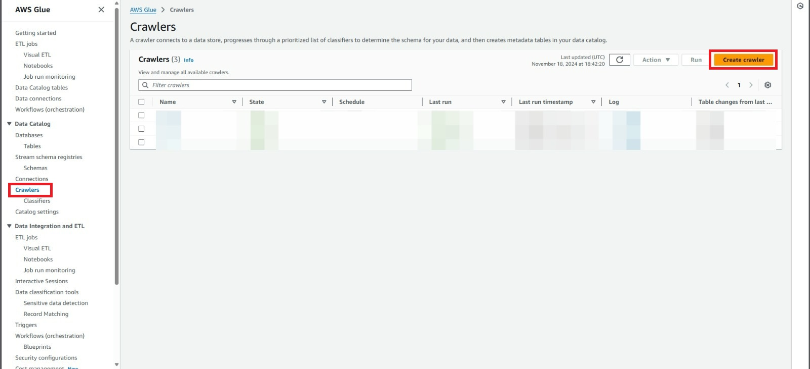

### Passo 2: Configurando o Crawler

Na tela de configuração do crawler, preencha as informações necessárias para definir a origem dos dados:

#### Nome do Crawler

- Nomeie o crawler de forma que ele seja facilmente identificável. Exemplo: `Filmes`.

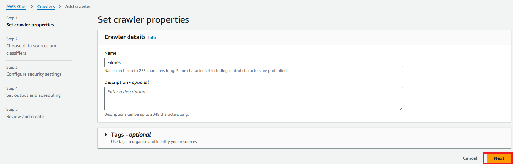

#### Fonte de Dados

1. Em **Data Store**, selecione **S3**.
2. Em **Location of S3 data**, escolha a opção **In this account.** e  logo abaixo insira o caminho do S3 onde os arquivos CSV ou Parquet estão armazenados.
   - Exemplo de caminho: `s3://data-lake-do-lucas/TRUSTED/Movies/`.

   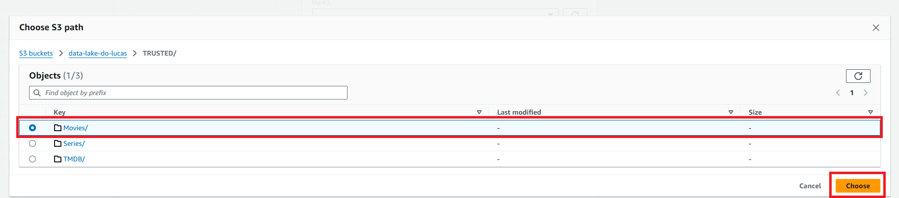

   

#### Escopo da Carga de Dados

1. Defina as opções de **Crawl all sub-folders** para incluir todos os arquivos dentro da pasta especificada.
2. O crawler irá detectar automaticamente os arquivos CSV ou Parquet armazenados no caminho especificado.

### Passo 3: Definindo ao IAM

#### Selecionando IAM Role

1. Em **Existing IAM role**, selecione um **IAM Role** que tenha as permissões necessárias para executar as atividades desejadas. O IAM Role deve permitir acesso ao S3 para leitura e gravação dos dados, além de permissões para o AWS Glue executar as tarefas de processamento e armazenamento de dados. 

   Se não houver um role adequado, você pode criar um novo IAM Role com as permissões específicas, garantindo que ele tenha políticas como **AmazonS3ReadOnlyAccess**, **AWSGlueServiceRole**, e **AmazonS3FullAccess** (ou políticas semelhantes adequadas às necessidades de seu fluxo de trabalho). 

   Após selecionar o role correto, esse IAM Role será associado ao seu job no AWS Glue, permitindo que ele tenha as permissões necessárias para acessar os recursos da AWS. 

   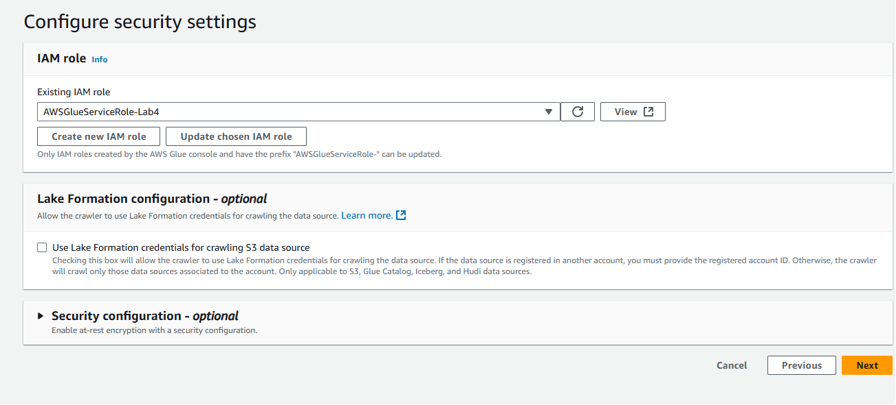

### Passo 4: Configurando a Database

1. Em **Set output and scheduling**, selecione uma **Target database** na qual você deseja armazenar as tabelas criadas pelos crawlers. A database selecionada será onde o AWS Glue armazenará o esquema dos dados processados, permitindo que você consulte os dados posteriormente no Athena. 

   Se você ainda não tiver uma database criada, pode criar uma nova no momento da configuração, ou selecionar uma já existente. Essa database será o destino onde as tabelas serão criadas após a execução do crawler.

  Abaixo está uma imagem ilustrativa de como selecionar a **Target database**:

   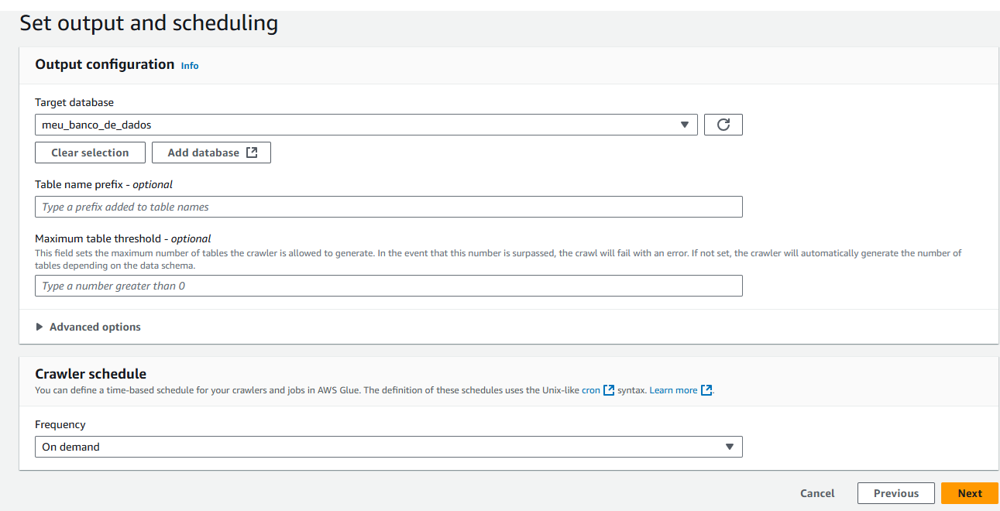

### Passo 6: Executando o Crawler

1. Após a criação, selecione o crawler recém-criado.
2. Clique em **Run Crawler** para iniciar o processo de descoberta dos dados.
3. O AWS Glue começará a ler os arquivos e a inferir a estrutura dos dados, criando as tabelas no catálogo de dados do Glue.
4. Apos esta execução podemos verificar no Crawler se a execução foi um sucesso

   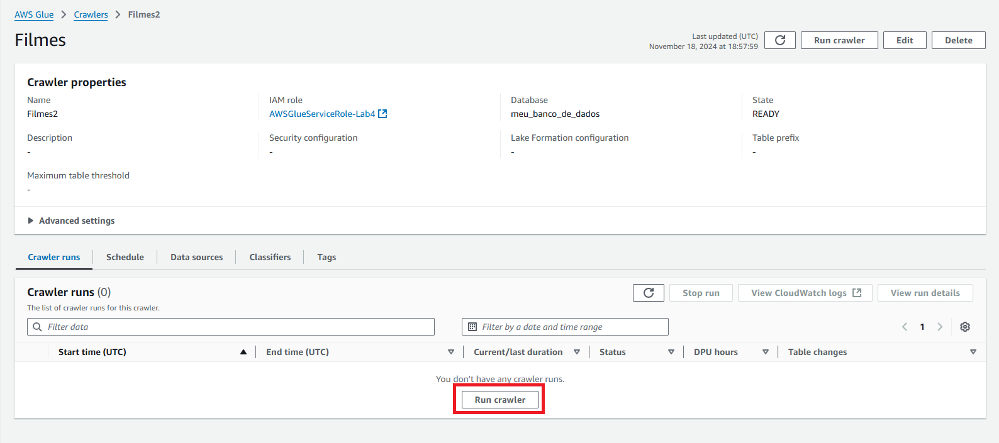
   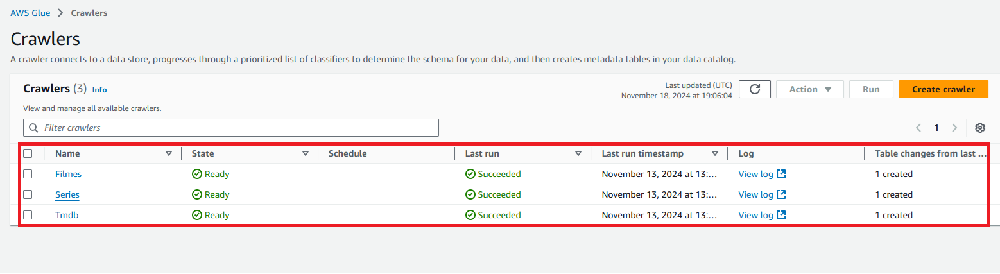

### Passo 7: Verificando as Tabelas no Athena

Após a execução do crawler, o AWS Glue terá criado automaticamente as tabelas correspondentes aos dados no Athena. Você pode acessar o Athena e executar consultas SQL sobre os dados.

1. Acesse o Console do Athena.
2. Selecione o banco de dados que você especificou no crawler (ex: `meu_banco_de_dados`).
3. Visualize as tabelas criadas para verificar a estrutura de dados e comece a executar consultas sobre elas.

### Exemplo de Tabela no Athena

Após o crawler ser executado, você pode consultar os dados da tabela criada. Exemplo de consulta para a tabela **Movies**:

```sql
SELECT * FROM movies LIMIT 10;
```

```sql
SELECT * FROM series LIMIT 10;
```

```sql
SELECT * FROM tmdb LIMIT 10;
```


Essa consulta retornará os primeiros 10 registros da tabela gerada a partir dos arquivos CSV ou Parquet no S3.

- Filmes
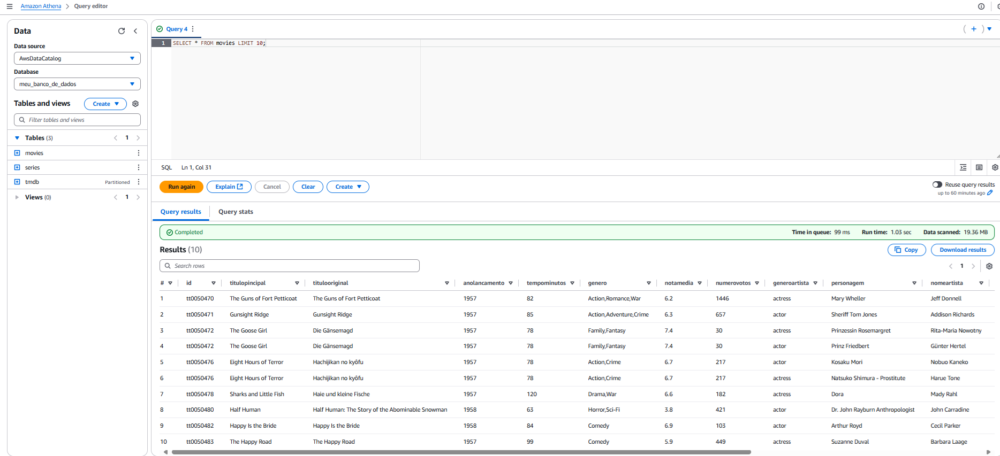

- Series 
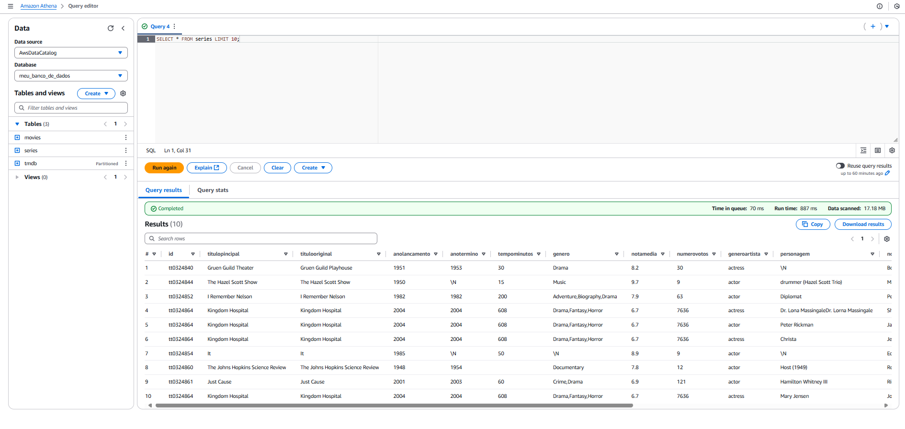

- TMDB 
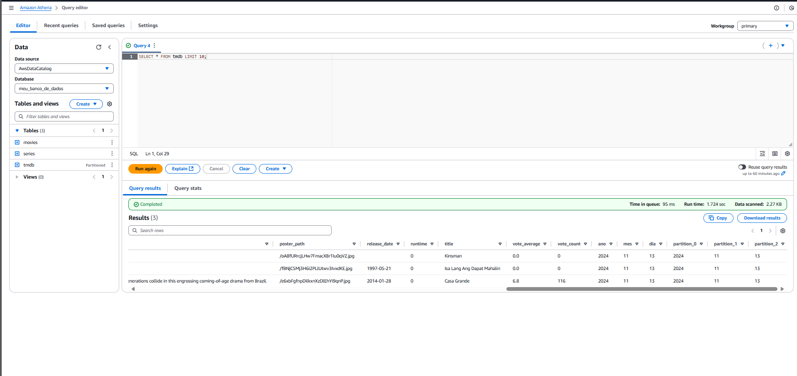

# ⚠️ Observação 

Em algumas consultas, determinados registros podem inicialmente aparentar duplicidade. Porém, ao analisá-los em detalhe, percebe-se que existem variações em seus campos ao longo da linha, o que os caracteriza como entradas distintas. Obrigado pela compreensão.

# Conclusão

Nesta parte do projeto, implementei com sucesso uma estrutura de Data Lake na AWS, configurando crawlers, jobs e pipelines que automatizam o processamento e a organização dos dados. Exploramos o uso do Apache Spark para transformar e limpar dados, aplicando técnicas de processamento e armazenamento otimizadas que aumentam a eficiência e facilitam a análise posterior dos dados com o Amazon Athena.
Ao seguir as etapas de configuração, desde a ingestão dos dados até a criação de tabelas e consultas, garantimos que os dados foram organizados de maneira segura e acessível para análises futuras. Esse processo não só possibilita a obtenção de insights mais ágeis, mas também fortalece a governança e confiabilidade dos dados no ambiente corporativo.
O projeto demonstra a importância de uma arquitetura de dados bem planejada e de ferramentas que automatizam processos, promovendo uma abordagem escalável para análises de grandes volumes de dados. Com essa estrutura, a empresa tem uma base sólida para expandir suas análises de dados, reduzindo o tempo e o esforço necessário para transformar dados brutos em informações estratégicas.
