# Modelagem-Análise

## **Objetivo** 

O objetivo é estruturar e transformar dados da camada Trusted para a camada Refined de um data lake, aplicando modelagem multidimensional e utilizando o AWS Glue com Apache Spark. Os dados transformados devem ser armazenados em formato PARQUET, preparados para análise e integração com ferramentas de visualização como Amazon QuickSight.


## Modelagem do Banco de Dados: 

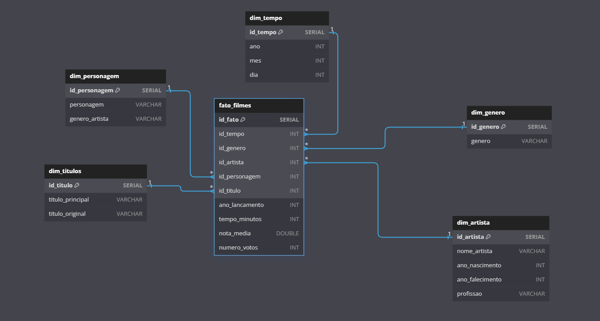


## 1. Etapa

### 1.1 Criando e Configurando o JOB

Nesta etapa, acessamos o **AWS Glue Console**, selecionamos a opção **ELT JOBS** e escolhemos **Spark Script Editor**. Como pode ser observado na imagem abaixo, esse é o primeiro passo para configurar o job que será utilizado para o processamento dos dados:


A partir dessa opção, você poderá escrever e configurar o script para processar os dados da camada Raw para a camada Trusted, utilizando o Apache Spark no AWS Glue.

Após isso, selecionamos a opção **Spark** para indicar o tipo de processamento que será utilizado no job. Veja a imagem abaixo:

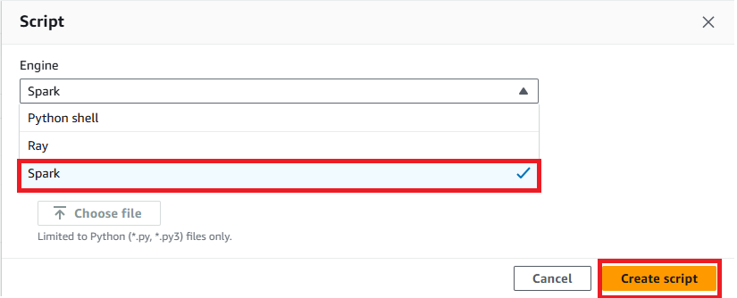

 - #### Configurando o JOB

Por fim, configuramos os jobs para **Series**, **Movies** e **Json** da seguinte forma:

- **Worker type**:  
  **G.1x** (Opção de menor configuração, recomendada para este desafio).

- **Requested number of workers**:  
  **2** (Esta é a quantidade mínima de workers para o job, conforme especificado).

- **Job timeout (minutes)**:  
  Defina o tempo limite do job para **60 minutos ou menos**, se possível.

Como podemos ver nas imagens a seguir:

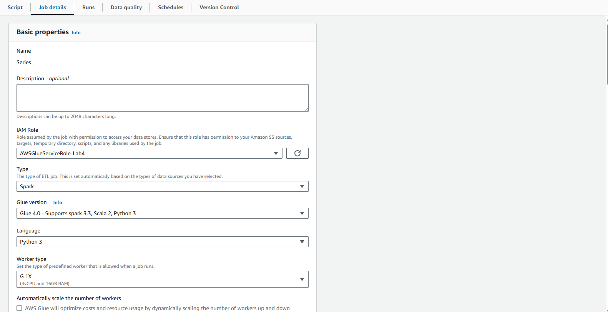  
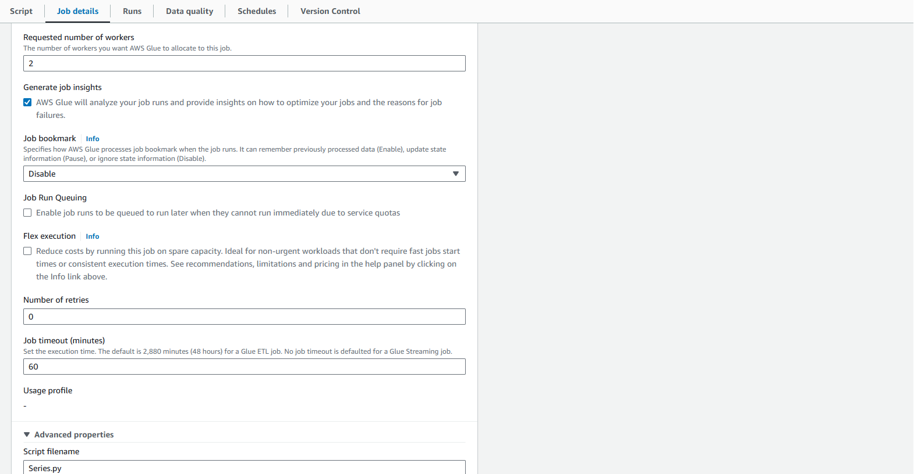  
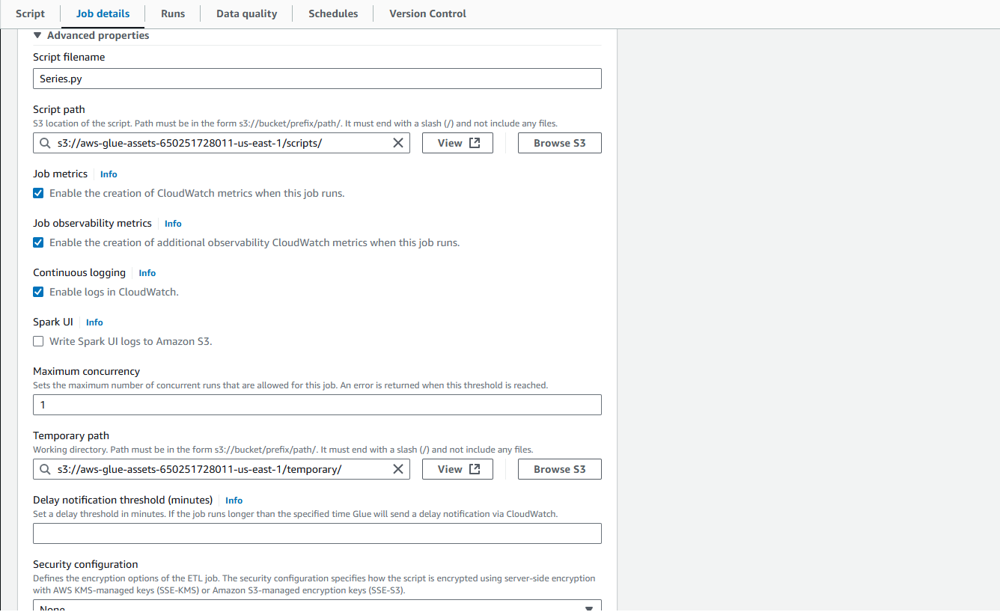


## 2. Etapa

### 2.1 Executando o JOB

Abaixo esta o código do job e as imagens de sua execução:

- #### Job: Processamento de Parquet para Refined Zone

### Passo 1: Importando as bibliotecas necessárias

No início do código, as bibliotecas essenciais para o processamento são importadas:

- **`SparkContext` e `SparkSession`**: Iniciam o contexto e a sessão do Apache Spark.
- **Funções do PySpark (`col`, `current_date`, etc.)**: Manipulam colunas e trabalham com datas nos DataFrames.

```python
from pyspark.context import SparkContext
from pyspark.sql import SparkSession
from pyspark.sql.functions import col, current_date, dayofmonth, month, year, monotonically_increasing_id
```

### Passo 2: Inicializando a sessão do Spark

Aqui, uma sessão do Spark é criada. A função `appName()` define o nome da aplicação como "Parquet_to_Refined", enquanto o método `getOrCreate()` reutiliza uma sessão existente ou cria uma nova.

```python
spark = SparkSession.builder.appName("Parquet_to_Refined").getOrCreate()
```

### Passo 3: Definindo os caminhos de entrada e saída

Os caminhos das zonas **Trusted** e **Refined** do Data Lake são configurados. Os dados de entrada estão na **Trusted Zone**, enquanto os dados processados serão armazenados na **Refined Zone**.

```python
trusted_path = "s3://data-lake-do-lucas/TRUSTED/Movies/2024/11/21/"
refined_path = "s3://data-lake-do-lucas/REFINED/"
```

### Passo 4: Carregando os dados da Trusted Zone

Os arquivos armazenados no formato **Parquet** são lidos para a memória usando o método `spark.read.parquet` e com a remoção de suas duplicatas. Os dados carregados são armazenados em DataFrames PySpark.

```python
df_trusted = spark.read.parquet(trusted_path)
df_trusted = df_trusted.dropDuplicates()
```

### Passo 5: Limpeza e transformação inicial dos dados

Os dados são transformados para ajustar os tipos das colunas e preparar as informações para as tabelas de dimensão e fato. O método `.withColumn()` converte os tipos de dados conforme necessário.

```python
df_trusted_movies = df_trusted_movies \
    .withColumn("anoLancamento", col("anoLancamento").cast("int")) \
    .withColumn("tempoMinutos", col("tempoMinutos").cast("int")) \
    .withColumn("notaMedia", col("notaMedia").cast("double")) \
    .withColumn("numeroVotos", col("numeroVotos").cast("int")) \
    .withColumn("anoNascimento", col("anoNascimento").cast("int")) \
    .withColumn("anoFalecimento", col("anoFalecimento").cast("int"))
```

### Passo 6: Adicionando colunas de data de processamento

Colunas para **ano**, **mês** e **dia** são adicionadas com base na data atual do processamento.

```python
df_trusted_movies = df_trusted_movies \
    .withColumn("ano", year(current_date())) \
    .withColumn("mes", month(current_date())) \
    .withColumn("dia", dayofmonth(current_date()))
```

### Passo 7: Criando tabelas de dimensões

### **Explicação da Criação das Dimensões**

O processo de criação das tabelas de dimensões envolve a extração de dados relevantes do DataFrame `df_trusted`, seguido pela aplicação de transformações, como a remoção de duplicatas, renomeação de colunas e a geração de IDs únicos para garantir a consistência e integridade dos dados. Cada tabela de dimensão é então salva no formato **Parquet**, que é um formato otimizado para leitura e escrita em grandes volumes de dados.

#### **1. Dimensão Títulos**

A **dimensão Títulos** contém informações sobre os títulos dos filmes, especificamente o título principal e o título original. 

- **Processo**:
  - Selecionamos as colunas `titulopincipal` e `titulooriginal`.
  - Aplicamos `.distinct()` para remover registros duplicados, garantindo que apenas títulos únicos sejam mantidos.
  - Renomeamos as colunas para `titulo_principal` e `titulo_original` para melhorar a legibilidade.
  - Geramos um **ID único** para cada título usando `monotonically_increasing_id()`, garantindo que cada título tenha uma chave única.

- **Código**:
  ```python
  dim_titulos = df_trusted.select("titulopincipal", "titulooriginal").distinct() \
    .withColumnRenamed("titulopincipal", "titulo_principal") \
    .withColumnRenamed("titulooriginal", "titulo_original") \
    .withColumn("id_titulo", monotonically_increasing_id())  
  dim_titulos.write.parquet(f"{refined_partition}dim_titulos", mode="overwrite")
  ```

#### **2. Dimensão Tempo**

A **dimensão Tempo** armazena informações relacionadas à data da execução, com as colunas `ano`, `mes` e `dia`.

- **Processo**:
  - Selecionamos as colunas `ano`, `mes` e `dia` do DataFrame.
  - Aplicamos `.distinct()` para garantir que não haja valores duplicados.
  - Geramos um **ID único** para cada combinação de data usando `monotonically_increasing_id()`.

- **Código**:
  ```python
  dim_tempo = df_trusted.select("ano", "mes", "dia").distinct().withColumn("id_tempo", monotonically_increasing_id())  
  dim_tempo.write.parquet(f"{refined_partition}dim_tempo", mode="overwrite")
  ```

#### **3. Dimensão Gênero**

A **dimensão Gênero** armazena os gêneros dos filmes.

- **Processo**:
  - Selecionamos a coluna `genero` do DataFrame.
  - Aplicamos `.distinct()` para garantir que não haja gêneros duplicados.
  - Geramos um **ID único** para cada gênero utilizando a função `hash()`. O uso do `hash()` garante que cada gênero tenha um ID único, mas o mesmo para dados idênticos.

- **Código**:
  ```python
  dim_genero = df_trusted.select("genero").distinct() \
    .withColumn("id_genero", hash("genero"))  
  dim_genero.write.parquet(f"{refined_partition}dim_genero", mode="overwrite")
  ```

#### **4. Dimensão Artista**

A **dimensão Artista** contém informações sobre os artistas envolvidos nos filmes, como nome, ano de nascimento, ano de falecimento e profissão.

- **Processo**:
  - Selecionamos as colunas `nomeartista`, `anonascimento`, `anofalecimento` e `profissao`.
  - Aplicamos `.distinct()` para eliminar registros duplicados.
  - Geramos um **ID único** para cada artista utilizando a função `hash()`, que leva em consideração todas as informações de identificação do artista.

- **Código**:
  ```python
  dim_artista = df_trusted.select("nomeartista", "anonascimento", "anofalecimento", "profissao").distinct() \
    .withColumn("id_artista", hash("nomeartista", "anonascimento", "anofalecimento", "profissao"))  
  dim_artista.write.parquet(f"{refined_partition}dim_artista", mode="overwrite")
  ```

#### **5. Dimensão Personagem**

A **dimensão Personagem** armazena informações sobre os personagens dos filmes, juntamente com o gênero do artista.

- **Processo**:
  - Selecionamos as colunas `personagem` e `generoartista` do DataFrame.
  - Aplicamos `.distinct()` para garantir que não existam duplicatas.
  - Geramos um **ID único** para cada personagem utilizando a função `hash()` nas colunas `personagem` e `generoartista`, criando uma chave única para cada personagem.

- **Código**:
  ```python
  dim_personagem = df_trusted.select("personagem", "generoartista").distinct() \
    .withColumn("id_personagem", hash("personagem", "generoartista"))  
  dim_personagem.write.parquet(f"{refined_partition}dim_personagem", mode="overwrite")
  ```


### Passo 8: Criando a tabela de fatos e removendo duplicatas

A tabela de fatos é gerada unindo as dimensões com os dados principais. A união utiliza chaves comuns entre as tabelas e mantém os IDs de cada dimensão. E também remove duplicatas.

```python
# Tabela de Fato: Filmes
fato_filmes = df_trusted \
    .join(dim_tempo, on=["ano", "mes", "dia"], how="inner") \
    .join(dim_genero, on=["genero"], how="inner") \
    .join(dim_artista, on=["nomeartista"], how="inner") \
    .join(dim_personagem, on=["personagem"], how="inner") \
    .join(dim_titulos, (df_trusted["titulopincipal"] == dim_titulos["titulo_principal"]) & 
                      (df_trusted["titulooriginal"] == dim_titulos["titulo_original"]), how="inner") \
    .select(
        "id_tempo", "id_genero", "id_artista", "id_personagem", "id_titulo",  
        "anoLancamento", "tempoMinutos", "notaMedia", "numeroVotos"
    ) \
    .distinct()  
```

---

### Passo 9: Finalizando a sessão do Spark

A execução do job é encerrada, liberando os recursos utilizados.

```python
spark.stop()
```

### Código completo

```python
from pyspark.context import SparkContext
from pyspark.sql import SparkSession
from pyspark.sql.functions import col, current_date, dayofmonth, month, year, monotonically_increasing_id, hash

spark = SparkSession.builder.appName("Parquet_to_Refined").getOrCreate()

trusted_path = "s3://data-lake-do-lucas/TRUSTED/Movies/2024/11/21/"
refined_path = "s3://data-lake-do-lucas/REFINED/"

df_trusted = spark.read.parquet(trusted_path)

df_trusted = df_trusted.dropDuplicates()

df_trusted = df_trusted \
    .withColumn("anoLancamento", col("anoLancamento").cast("int")) \
    .withColumn("tempoMinutos", col("tempoMinutos").cast("int")) \
    .withColumn("notaMedia", col("notaMedia").cast("double")) \
    .withColumn("numeroVotos", col("numeroVotos").cast("int")) \
    .withColumn("anoNascimento", col("anoNascimento").cast("int")) \
    .withColumn("anoFalecimento", col("anoFalecimento").cast("int"))

df_trusted = df_trusted \
    .withColumn("ano", year(current_date())) \
    .withColumn("mes", month(current_date())) \
    .withColumn("dia", dayofmonth(current_date()))

refined_partition = f"{refined_path}Movies/{df_trusted.select('ano').first()['ano']}/{df_trusted.select('mes').first()['mes']}/{df_trusted.select('dia').first()['dia']}/"

# Dimensão: Títulos
dim_titulos = df_trusted.select("titulopincipal", "titulooriginal").distinct() \
    .withColumnRenamed("titulopincipal", "titulo_principal") \
    .withColumnRenamed("titulooriginal", "titulo_original") \
    .withColumn("id_titulo", monotonically_increasing_id())  
dim_titulos.write.parquet(f"{refined_partition}dim_titulos", mode="overwrite")

# Dimensão: Tempo
dim_tempo = df_trusted.select("ano", "mes", "dia").distinct().withColumn("id_tempo", monotonically_increasing_id())  
dim_tempo.write.parquet(f"{refined_partition}dim_tempo", mode="overwrite")

# Dimensão: Gênero
dim_genero = df_trusted.select("genero").distinct() \
    .withColumn("id_genero", hash("genero"))  
dim_genero.write.parquet(f"{refined_partition}dim_genero", mode="overwrite")

# Dimensão: Artista
dim_artista = df_trusted.select("nomeartista", "anonascimento", "anofalecimento", "profissao").distinct() \
    .withColumn("id_artista", hash("nomeartista", "anonascimento", "anofalecimento", "profissao"))  
dim_artista.write.parquet(f"{refined_partition}dim_artista", mode="overwrite")

# Dimensão: Personagem
dim_personagem = df_trusted.select("personagem", "generoartista").distinct() \
    .withColumn("id_personagem", hash("personagem", "generoartista"))  
dim_personagem.write.parquet(f"{refined_partition}dim_personagem", mode="overwrite")

# Tabela de Fato: Filmes
fato_filmes = df_trusted \
    .join(dim_tempo, on=["ano", "mes", "dia"], how="inner") \
    .join(dim_genero, on=["genero"], how="inner") \
    .join(dim_artista, on=["nomeartista"], how="inner") \
    .join(dim_personagem, on=["personagem", "generoartista"], how="inner") \
    .join(dim_titulos, (df_trusted["titulopincipal"] == dim_titulos["titulo_principal"]) & 
                      (df_trusted["titulooriginal"] == dim_titulos["titulo_original"]), how="inner") \
    .select(
        "id_tempo", "id_genero", "id_artista", "id_personagem", "id_titulo",  
        "anoLancamento", "tempoMinutos", "notaMedia", "numeroVotos"
    ) \
    .distinct()  

fato_filmes.write.parquet(f"{refined_partition}fato_filmes", mode="overwrite")

spark.stop()

print("Arquivos Parquet processados e salvos com sucesso na Refined Zone!")

```

## OBS: 
 - Comentários foram adicionados em cada DIM para facilitar a identificação de cada uma, tornando o código mais claro e compreensível.
   Como por exemplo: `# Dimensão: Personagem` para assim auxiliar na analise do código.


## Execução


## 3. Etapa

### 3.1 Criando o Crawler

Nesta etapa, vamos criar o crawler no AWS Glue para possibilitar a execução de consultas sobre os dados no Athena. A criação dos crawlers permite mapear os dados armazenados no Amazon S3, definindo a estrutura das tabelas no Athena.

Aqui está o passo a passo para criar os crawlers:

### Passo 1: Acessando o Console do AWS Glue

1. Acesse o console do AWS Glue.
2. No painel esquerdo, clique em **Crawlers** sob a seção "Data Catalog".
3. Clique em **Add crawler** para iniciar a criação de um novo crawler.


### Passo 2: Configurando o Crawler

Na tela de configuração do crawler, preencha as informações necessárias para definir a origem dos dados:

#### Nome do Crawler

- Nomeie o crawler de forma que ele seja facilmente identificável. Exemplo: `Refined - Filmes`.

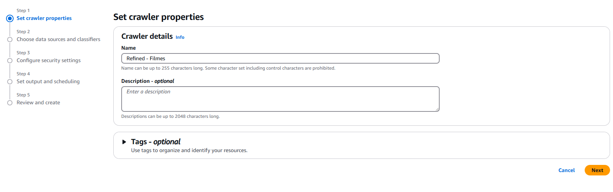

1. Em **Data Store**, selecione **S3**.
2. Em **Location of S3 data**, escolha a opção **In this account.** e  logo abaixo insira o caminho do S3 onde os arquivos CSV ou Parquet estão armazenados.
   - Exemplo de caminho: `s3://data-lake-do-lucas/REFINED/Movies/`.

   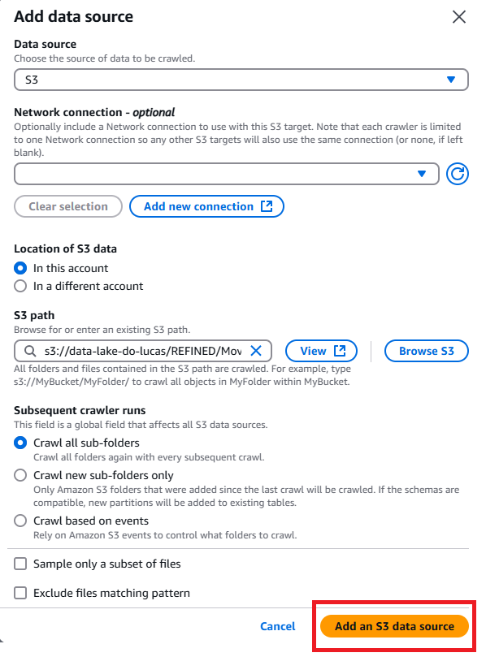

   #### Escopo da Carga de Dados

1. Defina as opções de **Crawl all sub-folders** para incluir todos os arquivos dentro da pasta especificada.
2. O crawler irá detectar automaticamente os arquivos CSV ou Parquet armazenados no caminho especificad

### Passo 3: Definindo ao IAM

#### Selecionando IAM Role

1. Em **Existing IAM role**, selecione um **IAM Role** que tenha as permissões necessárias para executar as atividades desejadas. O IAM Role deve permitir acesso ao S3 para leitura e gravação dos dados, além de permissões para o AWS Glue executar as tarefas de processamento e armazenamento de dados. 

   Se não houver um role adequado, você pode criar um novo IAM Role com as permissões específicas, garantindo que ele tenha políticas como **AmazonS3ReadOnlyAccess**, **AWSGlueServiceRole**, e **AmazonS3FullAccess** (ou políticas semelhantes adequadas às necessidades de seu fluxo de trabalho). 

   Após selecionar o role correto, esse IAM Role será associado ao seu job no AWS Glue, permitindo que ele tenha as permissões necessárias para acessar os recursos da AWS. 

   

   ### Passo 4: Configurando a Database
   
   1. Em **Set output and scheduling**, selecione uma **Target database** na qual você deseja armazenar as tabelas criadas pelos crawlers. A database selecionada será onde o AWS Glue armazenará o esquema dos dados processados, permitindo que você consulte os dados posteriormente no Athena. 
   
      Se você ainda não tiver uma database criada, pode criar uma nova no momento da configuração, ou selecionar uma já existente. Essa database será o destino onde as tabelas serão criadas após a execução do crawler.
   
     Abaixo está uma imagem ilustrativa de como selecionar a **Target database**:
   
      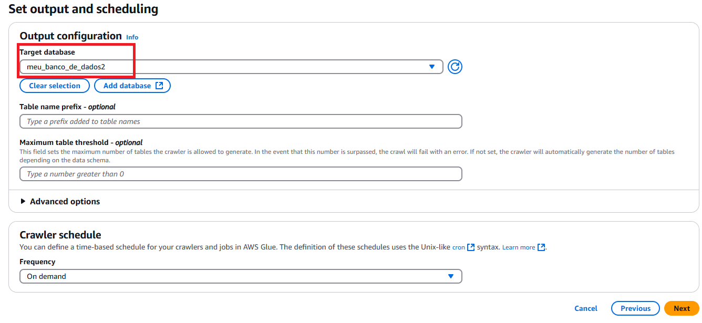
  
  ### Passo 6: Executando o Crawler
  
  1. Após a criação, selecione o crawler recém-criado.
  2. Clique em **Run Crawler** para iniciar o processo de descoberta dos dados.
  3. O AWS Glue começará a ler os arquivos e a inferir a estrutura dos dados, criando as tabelas no catálogo de dados do Glue.
  4. Apos esta execução podemos verificar no Crawler se a execução foi um sucesso
  
     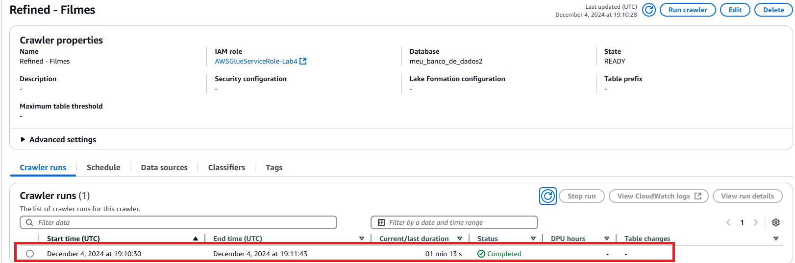
     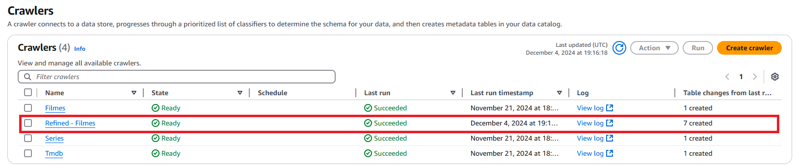
   
### Passo 7: Verificando as Tabelas no Athena

Após a execução do crawler, o AWS Glue terá criado automaticamente as tabelas correspondentes aos dados no Athena. Você pode acessar o Athena e executar consultas SQL sobre os dados.

1. Acesse o Console do Athena.
2. Selecione o banco de dados que você especificou no crawler (ex: `meu_banco_de_dados2`).
3. Visualize as tabelas criadas para verificar a estrutura de dados e comece a executar consultas sobre elas.

### Exemplo de consulta no Athena

Após o crawler ser executado, você pode consultar os dados da tabela criada:

## Comando da consulta:
```sql
SELECT 
    a.nomeartista, 
    a.profissao, 
    p.personagem, 
    t.titulo_principal, 
    g.genero, 
    f.anolancamento, 
    f.tempominutos, 
    f.notamedia, 
    f.numerovotos
FROM 
    fato_filmes f
JOIN 
    dim_artista a ON f.id_artista = a.id_artista
JOIN 
    dim_personagem p ON f.id_personagem = p.id_personagem
JOIN 
    dim_titulos t ON f.id_titulo = t.id_titulo
JOIN 
    dim_genero g ON f.id_genero = g.id_genero
WHERE 
    a.nomeartista = 'Suzana Pires'
    AND REGEXP_LIKE(g.genero, 'Drama')
    AND t.titulo_principal = 'Casa Grande';

```

## Resultado: 

| #  | Nome Artista    | Profissão                | Personagem       | Título Principal | Gênero          | Ano Lançamento | Tempo (minutos) | Nota Média | Número de Votos |
|----|-----------------|--------------------------|------------------|------------------|-----------------|-----------------|-----------------|------------|-----------------|
| 1  | Suzana Pires    | actress, writer, producer | Sônia Cavalcanti | Casa Grande      | Drama, Romance  | 2014            | 115             | 6.9        | 2782            |

  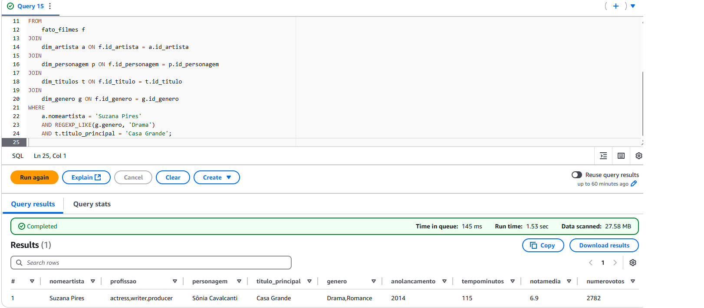

# Análises Pretendidas

- **Evolução da Popularidade dos Gêneros Drama e Romance**:  
  Analisar a quantidade de filmes dos gêneros Drama e Romance lançados ao longo dos anos para identificar tendências e entender como a popularidade desses gêneros evoluiu com o tempo.

- **Avaliação Média dos Filmes de Drama**:  
  Examinar as notas médias atribuídas aos filmes do gênero Drama para avaliar a percepção crítica e identificar possíveis variações na qualidade percebida ao longo dos anos.

- **Comparação do Número de Votos por Gênero**:  
  Comparar o número de votos recebidos pelos filmes dos gêneros Drama e Romance em relação a outros gêneros para entender o nível de engajamento e preferência do público.

# Conclusão

Neste desafio, realizamos com sucesso a normalização de uma tabela de locação, estruturando os dados de forma a reduzir redundâncias e melhorar a integridade e consistência das informações. A separação em tabelas normalizadas garantiu que cada dado fosse armazenado em seu local apropriado, atendendo às boas práticas de modelagem de bancos de dados relacionais.
Além disso, exploramos a modelagem dimensional, criando uma estrutura que facilita a análise de dados e a criação de relatórios gerenciais. A construção de tabelas fato e dimensão proporcionou uma abordagem eficiente e escalável para consultas analíticas, permitindo à empresa extrair insights valiosos a partir de grandes volumes de dados.
O projeto destaca a importância de uma base de dados bem planejada, que não apenas otimiza o armazenamento, mas também oferece flexibilidade para atender às demandas analíticas. Com essa estrutura, a empresa está preparada para aprimorar sua inteligência de negócios, reduzindo o tempo e o esforço necessários para transformar dados operacionais em informações estratégicas.
