## **Objetivo**

Consumir dados da camada **Refined** de um data lake utilizando **Amazon Athena** e visualizá-los no **Amazon QuickSight**. O propósito é criar dashboards interativos que forneçam insights agregados e narrativas claras, facilitando a interpretação e apresentação das análises.

## 1. **Etapa: Configurando QuickSight**

Nesta etapa, vamos configurar uma nova análise no **Amazon QuickSight** para consumir os dados da camada **Refined** no **Athena**.

### 1.1 **Criar Nova Análise**

Primeiramente, selecione a opção **"New analysis"**, como ilustrado na imagem a seguir:


### 1.2 **Criar Novo Dataset**

Na próxima tela, clique em **"New dataset"**:


### 1.3 **Selecionar o Dataset Athena**

Na tela de seleção de datasets, escolha **Athena** como a fonte de dados:


### 1.4 **Selecionar Caminho e Tabela**

Após selecionar o dataset, configure o **Athena Data Source**, atribuindo um nome a ele (por exemplo, *Análise Final*). Em seguida, selecione o banco de dados e a tabela desejada:

  

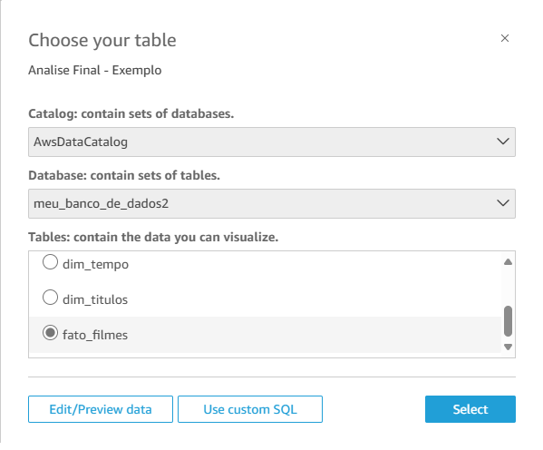

### 1.5 **Adicionar Tabelas e Realizar o Inner Join**

Adicione todas as tabelas necessárias e relacione-as com a **Tabela Fato**. No exemplo, a tabela **`fato_filmes`** é relacionada às demais tabelas pelos **IDs em comum**, utilizando a opção de **Inner Join**:


### 1.6 **Publicar e Visualizar**

Por fim, clique em **"Publish & Visualize"** para gerar a visualização dos dados:

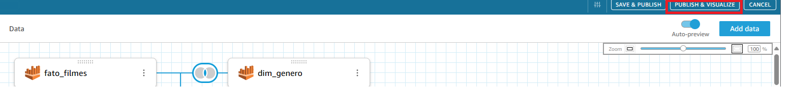  

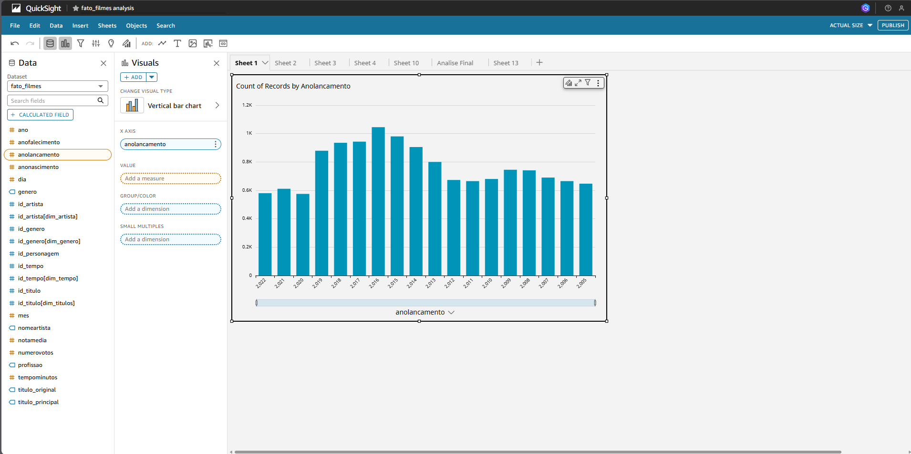

Agora, com tudo configurado, você poderá criar suas análises e gerar os gráficos desejados para seus dashboards no **Amazon QuickSight**.

-------------

## **2. Etapa: Minhas Análises**

Nesta etapa, apresentarei uma série de análises focadas nos gêneros **Drama** e **Romance**, abordando temas específicos relacionados à presença feminina no cinema e às preferências de gênero cinematográfico. As análises exploram os seguintes pontos:

### **2.1. Popularidade dos Gêneros**  
- **Objetivo:** Comparar os gêneros **Drama** e **Romance** com outros gêneros para identificar quais são os mais populares.  
- **Questões analisadas:**  
  - Drama e Romance são gêneros preferidos por um público específico?  
  - Como esses gêneros se posicionam em relação a outros gêneros populares?  

### **2.2. Participação de Suzana Pires**  
- **Objetivo:** Analisar a carreira de Suzana Pires em termos de gêneros cinematográficos.  
- **Questões analisadas:**  
  - Em quais gêneros Suzana Pires atua com mais frequência?  
  - Existem padrões nos gêneros dos filmes em que Suzana Pires participa?  

### **2.3. Comparação com um Ator Brasileiro**  
- **Objetivo:** Comparar a atuação de Suzana Pires com a de um ator brasileiro em relação à escolha de gêneros.  
- **Questões analisadas:**  
  - Quais gêneros são mais comuns nos filmes desse ator em comparação com Suzana Pires?  
  - Há diferenças significativas na escolha de gêneros entre atores masculinos e atrizes femininas?  

### **2.4. Preferências de Gêneros por Sexo**  
- **Objetivo:** Identificar tendências de preferência de gênero entre atores e atrizes.  
- **Questões analisadas:**  
  - Quais gêneros são mais populares entre atores masculinos e quais entre atrizes femininas?  
  - Existem diferenças significativas nas preferências de gênero cinematográfico entre homens e mulheres?  

### **2.5. Popularidade dos Artistas**  
- **Objetivo:** Analisar a popularidade dos artistas com base na quantidade de votos recebidos.  
- **Questões analisadas:**  
  - Quem são os 10 artistas mais populares atualmente?  
  - Artistas masculinos são mais populares do que artistas femininas?  
  - A quantidade de votos recebidos varia entre artistas masculinos e femininas?  

# Analises 

### **2.1. Popularidade dos Gêneros** 

Nesta análise, busquei comparar os gêneros **Drama** e **Romance** com o gênero **Comédia**, visando entender quais são os gêneros mais populares de forma geral, com base no número de votos recebidos.

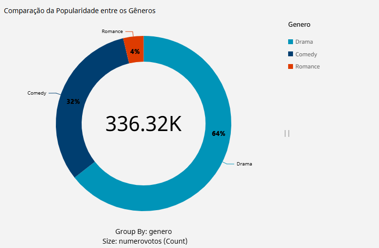

Os resultados mostram uma clara preferência do público por **Drama**, seguido de **Comédia**, com **Romance** ocupando a última posição. A distribuição dos votos ficou da seguinte forma:

1. **Drama** – 64% dos votos
2. **Comédia** – 32% dos votos
3. **Romance** – 4% dos votos

Esses dados sugerem que, enquanto o gênero Drama atrai uma audiência significativa, a Comédia também se mantém popular, embora com um número menor de votos comparado ao Drama. O gênero Romance, por outro lado, apresenta um número consideravelmente menor de votos, indicando que sua popularidade é bem mais restrita. 
Essas informações podem ser úteis para entender as preferências do público e como o gênero pode influenciar o sucesso de um filme.

#### Filtros utilizados:

Para esta análise, foram aplicados os seguintes filtros para os **Gêneros**:

**Gênero**: Considerando apenas os gêneros Drama, Romance e Comédia.

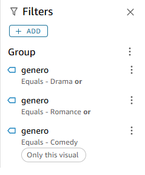


### **2.2. Participação de Suzana Pires** 

O objetivo desta análise é investigar a carreira de Suzana Pires, enfocando os gêneros cinematográficos nos quais ela mais se destaca. A análise se concentra em identificar quais gêneros dominam sua trajetória profissional e examinar se há padrões recorrentes nos tipos de filmes em que ela participa.


A análise dos filmes de Suzana Pires revela que sua carreira é marcada principalmente por atuações em comédias e dramas. Ela participou de comédias como *"De Perto Ela Não é Normal"* e *"Loucas pra Casar"*, indicando que este gênero é uma constante em sua trajetória.  
Além disso, Suzana também tem presença significativa em dramas, como *"A Grande Vitória"* e *"Casa Grande"*. Isso demonstra uma versatilidade entre os gêneros de comédia e drama, embora comédias sejam ligeiramente mais frequentes.  
Embora os filmes tenham recebido avaliações variadas, a diversidade de gêneros evidencia a capacidade de Suzana Pires de se adaptar a diferentes narrativas e públicos, consolidando sua posição como uma atriz versátil e dinâmica no cenário cinematográfico.

#### Filtros utilizados:

Para esta análise, foi aplicado o seguinte filtro para o **id_artista**:

**id_artista**: Considerando buscar apenas o ID da atriz Suzana Pires.

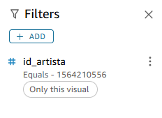

### **2.3. Comparação com um Ator Brasileiro**

O objetivo desta análise é comparar a carreira de Suzana Pires com a de um ator brasileiro, **Marcos Caruso**, enfocando a escolha de gêneros cinematográficos. A análise busca identificar semelhanças e diferenças nos gêneros predominantes em suas trajetórias, além de explorar possíveis padrões relacionados ao gênero dos atores. Dessa forma, procura-se entender se uma atriz como Suzana Pires tende a atuar nos mesmos tipos de filmes que um ator como Marcos Caruso.


A análise dos filmes de **Marcos Caruso** revela que ele atua predominantemente nos gêneros **comédia** e **comédia romântica**, com uma incursão ocasional em **ação** e **drama**. Dos filmes avaliados:

- **Comédias** como *"Desculpe o Transtorno"*, *"Sorria, Você Está Sendo Filmado"* e *"Memórias Póstumas de Brás Cubas"* marcam uma parte significativa de sua filmografia.  
- Ele também participa de filmes de **comédia romântica**, como *"Depois Daquele Baile"*.  
- Em contraste, **"Operações Especiais"** demonstra sua participação em gêneros de **ação** e **crime**.

Ao comparar com **Suzana Pires**, observa-se que:

- Ambos compartilham uma forte presença em **comédias** e **dramas**, sugerindo que esses gêneros são comuns tanto para atrizes quanto para atores.  
- No entanto, Marcos Caruso também tem presença em **comédias românticas** e filmes de **ação**, gêneros que não aparecem na amostra analisada da carreira de Suzana Pires.  
- Além disso, **Marcos Caruso é escalado para filmes de comédia com maior frequência do que Suzana Pires**, reforçando sua associação com esse gênero específico.

Essa comparação indica que, enquanto há uma preferência compartilhada por **comédias** e **dramas**, Marcos Caruso explora uma gama ligeiramente mais ampla de gêneros. Isso pode refletir tanto escolhas individuais de carreira quanto tendências do mercado cinematográfico em escalar atores masculinos para filmes de **ação** e **crime**.

#### Filtros utilizados:

Para esta análise, foi aplicado o seguinte filtro para o **id_artista**:

**id_artista**: Considerando buscar apenas o ID do ator Marcos Caruso.

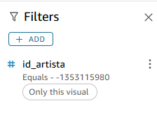

### **2.4. Preferências de Gêneros por Sexo** 

O objetivo desta análise é identificar tendências de preferência de gênero cinematográfico entre atores e atrizes, utilizando os gêneros **Drama**, **Romance** e **Comédia** como métricas para avaliar em quais categorias há predominância de atores ou atrizes.

#### **Drama e Romance:**  


#### **Comédia:**  


Ao analisarmos os gráficos de barras, notamos que a frequência de atrizes nos gêneros **Drama** e **Romance** é maior em comparação ao gênero **Comédia**. Por outro lado, os atores tendem a ter uma participação mais expressiva em comédias.  
Essa tendência pode ser evidenciada na comparação entre a carreira de **Marcos Caruso** e **Suzana Pires**. Enquanto Suzana Pires atua predominantemente em dramas e comédias, Marcos Caruso apresenta uma presença mais marcante em comédias, incluindo comédias românticas e uma incursão ocasional em dramas e ação.
Esses padrões sugerem que atrizes são mais frequentemente escaladas para papéis em **Drama** e **Romance**, enquanto atores têm mais oportunidades no gênero **Comédia** e suas variações.

#### Filtros utilizados - Drama e Romance:

Para esta análise, foram aplicadso os seguinte filtros para **Profissão** e **Gênero**:

**Profissão**: Considerando buscar apenas: atores e atrizes.<br>
**Gênero**: Considerando apenas os gêneros: Drama,Romance.

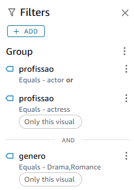

#### Filtros utilizados - Comedia:

Para esta análise, foram aplicadso os seguinte filtros para **Profissão** e **Gênero**:

**Profissão**: Considerando buscar apenas atores e atrizes.<br>
**Gênero**: Considerando apenas o gênero: Comedia.

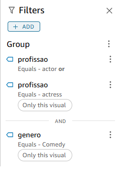

### **2.5. Popularidade dos Artistas**  

O objetivo desta análise é examinar a popularidade dos artistas com base na quantidade de votos recebidos, a fim de identificar quem são os artistas mais populares atualmente e se existem diferenças significativas entre a presença dos gêneros masculino e feminino na  particpação neste  top 10 artistar mais populares.

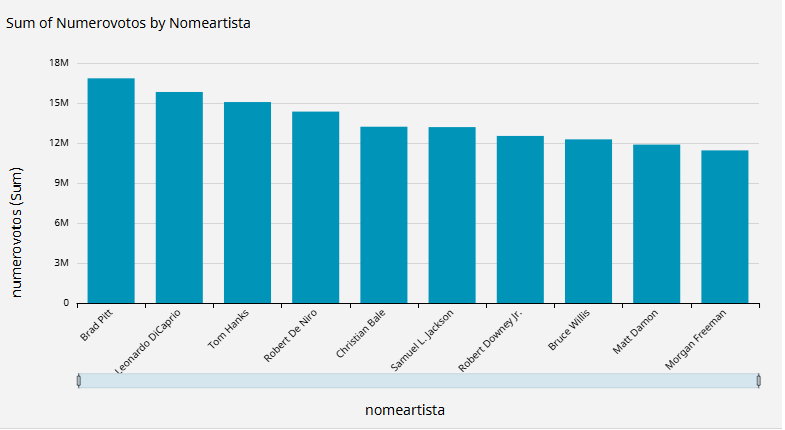

A análise dos 10 artistas mais populares revela uma predominância absoluta de artistas masculinos na lista, com nenhum espaço ocupado por artistas femininas. Isso sugere uma possível disparidade na popularidade entre os gêneros no contexto atual, refletindo possíveis tendências de mercado ou preferências de público que favorecem os homens. Essa ausência de representação feminina no top 10 pode indicar desafios na equidade de visibilidade e reconhecimento para as mulheres na indústria cinematográfica. A partir dessa observação, é possível levantar questões sobre a influência dos fatores socioculturais, como estereótipos de gênero e o papel da mídia, na construção dessas preferências de popularidade.

#### Filtros utilizados:

Para esta análise, foi aplicado o seguinte filtro para o **número de votos**:

**Número de Votos**: Entre 11.446.116 e 16.850.335

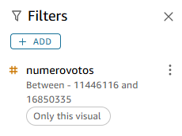

**Observação:**

```sql
SELECT 
    a.id_artista,  
    a.nomeartista, 
    a.profissao, 
    SUM(f.numerovotos) AS total_votos
FROM 
    fato_filmes f
JOIN 
    dim_artista a ON f.id_artista = a.id_artista
GROUP BY 
    a.id_artista, a.nomeartista, a.profissao
ORDER BY 
    total_votos DESC
LIMIT 10;
```

Essa query foi utilizada no **Athena** para identificar os 10 artistas mais votados dentro da faixa de votos especificada, proporcionando uma análise mais precisa das notas mínimas e máximas dos artistas mais famosos, com base no número de votos recebidos. Após isso, o filtro foi ajustado no **AWS QuickSight** para uma visualização mais detalhada dos dados.


## **3. Etapa: Conclusão**

A análise das trajetórias de **Suzana Pires** e **Marcos Caruso**, juntamente com a comparação das preferências de gêneros e a popularidade dos artistas, oferece uma visão reveladora sobre as dinâmicas da indústria cinematográfica brasileira e mundial. Suzana Pires se destaca principalmente em **comédias** e **dramas**, demonstrando grande versatilidade como atriz. Quando comparamos sua carreira com a de **Marcos Caruso**, percebemos que ambos compartilham uma forte presença em comédias e dramas, mas Caruso também se aventura em **comédias românticas** e **ação**, ampliando seu repertório de atuação.
A análise das preferências de gênero por sexo revela uma tendência clara: atrizes são mais frequentemente associadas a **dramas** e **romances**, enquanto os atores dominam o gênero **comédia**, incluindo suas variações, como a comédia romântica. Essa divisão de papéis, refletida em escolhas de gênero, sugere não apenas padrões no mercado cinematográfico, mas também influências sociais sobre o que é considerado "adequado" para homens e mulheres no cinema.
Ademais, a análise da popularidade dos artistas mostra uma disparidade de gênero, com o top 10 artistas mais populares sendo inteiramente dominado por homens, sem qualquer representação feminina. Isso destaca a desigualdade na visibilidade e no reconhecimento do trabalho feminino, possivelmente impulsionada por estereótipos de gênero e uma representação desigual das mulheres nas telas. 
Esses padrões sugerem que, embora haja semelhanças nas escolhas de papéis entre atores e atrizes, as tendências de gênero ainda favorecem os homens em termos de participação em filmes e da popularidade alcançada. Isso reforça a necessidade urgente de uma reflexão mais profunda sobre como o mercado cinematográfico pode promover maior equidade, tanto na distribuição de papéis quanto no reconhecimento público, garantindo maior diversidade e representatividade para todos os gêneros.

# Conclusao

Nesta Sprint, tive a oportunidade de aprimorar minhas habilidades de análise de dados, gerando insights valiosos que me permitiram encontrar as respostas buscadas desde o início do Desafio Final. Através da análise das trajetórias de Suzana Pires e Marcos Caruso, da comparação das preferências de gêneros e da popularidade dos artistas, identifiquei padrões importantes que revelam a dinâmica da indústria cinematográfica, destacando as diferenças de gênero na escolha de papéis e na visibilidade dos artistas. Esses resultados não apenas confirmaram as hipóteses iniciais, mas também proporcionaram uma visão mais clara das tendências do mercado e das questões relacionadas à equidade de gênero.
Este processo de análise foi crucial para meu desenvolvimento, pois não só me ajudou a responder às perguntas propostas, mas também ampliou minha compreensão sobre como os dados podem ser utilizados para gerar conhecimento relevante e estratégico.
